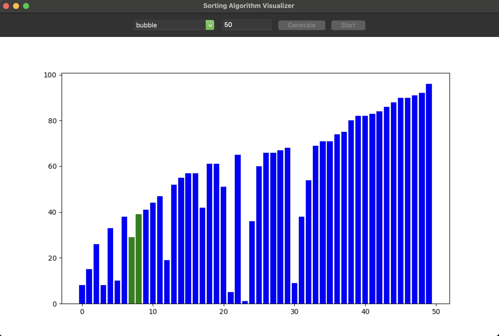
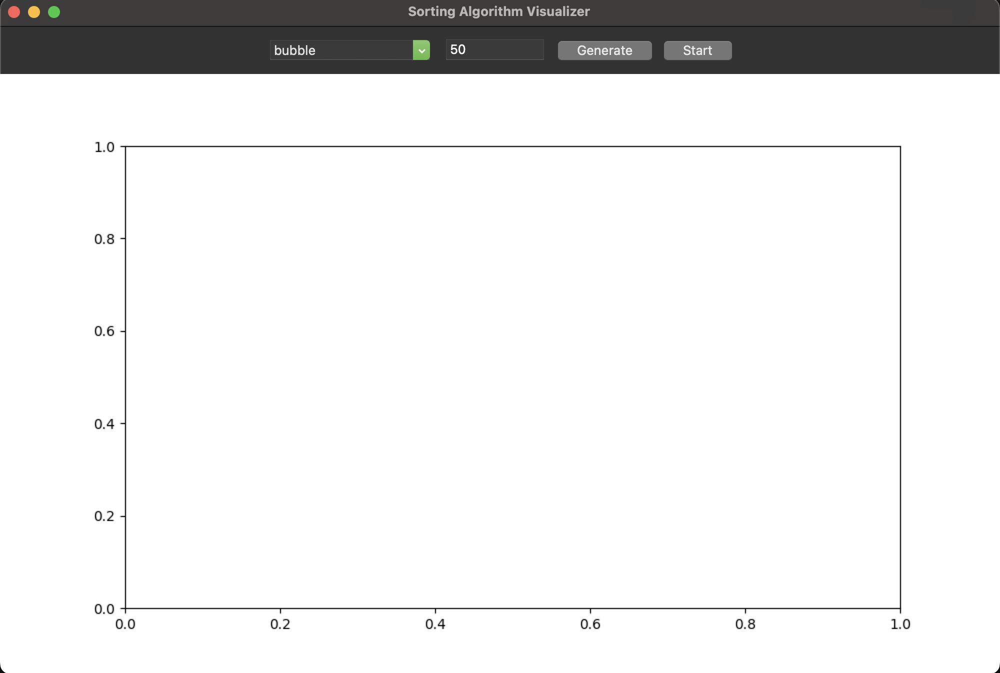
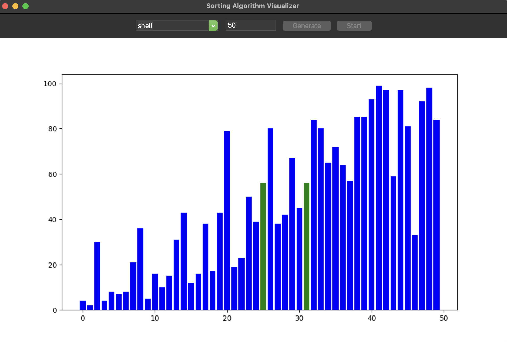

# Sorting Algorithm Visualizer

  

## Overview
This project is a **Sorting Algorithm Visualizer** that allows users to visualize how different sorting algorithms work in real-time. It provides an interactive GUI where users can select a sorting algorithm, specify the number of elements, and watch the algorithm sort the data step-by-step.

The visualizer is built using **Python** with **Tkinter** for the GUI and **Matplotlib** for the visualization. It supports multiple sorting algorithms, including Bubble Sort, Selection Sort, Insertion Sort, Merge Sort, Quick Sort, Heap Sort, Counting Sort, Shell Sort, Radix Sort, and Bucket Sort.

---

## Features
- **Interactive GUI**: Users can select a sorting algorithm and specify the number of elements to sort.
- **Real-Time Visualization**: Watch the sorting process in real-time with a bar chart representation.
- **Multiple Algorithms**: Supports 10 different sorting algorithms.
- **Customizable Data**: Generate random data for sorting.
- **User-Friendly**: No need to use the terminal; everything is controlled through the GUI.

---

## Supported Sorting Algorithms
1. **Bubble Sort**
2. **Selection Sort**
3. **Insertion Sort**
4. **Merge Sort**
5. **Quick Sort**
6. **Heap Sort**
7. **Counting Sort**
8. **Shell Sort**
9. **Radix Sort**
10. **Bucket Sort**

---

## Requirements
To run this project, you need the following Python libraries:
- `numpy`
- `matplotlib`
- `tkinter`

You can install the required libraries using `pip`:
```bash
pip install numpy matplotlib
```

---

## How to Run
1. Clone the repository:
   ```bash
   git clone https://github.com/your-username/Sort_Visualizer.git
   cd Sort_Visualizer
   ```

2. Run the script:
   ```bash
   python sort_visualizer.py
   ```

3. Use the GUI:
   - Select a sorting algorithm from the dropdown menu.
   - Enter the number of elements to sort.
   - Click **Generate** to create random data.
   - Click **Start** to begin the sorting visualization.

---

## Screenshots
### Main Window
  

### Sorting in Progress
  

---

## Contributing
Contributions are welcome! If you'd like to add new features, improve the code, or fix bugs, please follow these steps:
1. Fork the repository.
2. Create a new branch for your feature or bugfix.
3. Commit your changes.
4. Submit a pull request.

---

Enjoy visualizing sorting algorithms! 🚀
